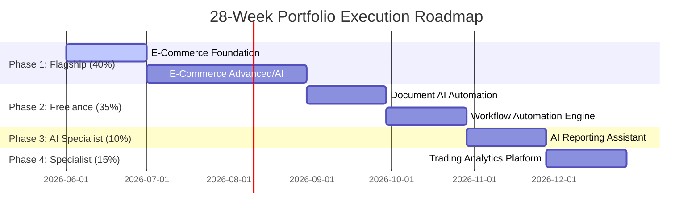
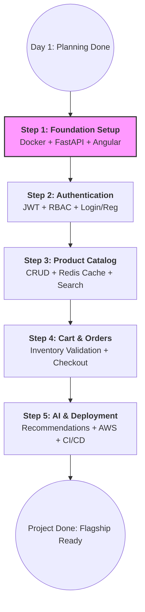

### **1. High-Level 28-Week Career Roadmap**
This chart visualizes your transition from planning into the four strategic phases defined in your **Career Execution Plan** and **Master Roadmap**.

---

### **2. Phase 1: Enterprise E-Commerce Execution Flow**
This diagram represents the "Day 2" workflow we discussed, moving from foundation setup to the "Definition of Done".

---

### **3. Master Progress Tracker (Trackable Feature)**
Based on the **Master Tracker** and **Sprint Planner**, use this table to track your live progress across the entire journey.

| Phase | Project | Deliverable | Status | Progress % | Owner |
| :--- | :--- | :--- | :--- | :--- | :--- |
| **Phase 1** | **E-Commerce** | **Sprint 1: Foundation Setup** | **In Progress** | **15%** | **Human/AI** |
| Phase 1 | E-Commerce | Sprint 2: Auth Module | Not Started | 0% | Human/AI |
| Phase 1 | E-Commerce | Sprint 3: Product Catalog | Not Started | 0% | Human/AI |
| Phase 1 | E-Commerce | Sprint 4: Cart & Orders | Not Started | 0% | Human/AI |
| Phase 2 | Document AI | OCR & Extraction | Not Started | 0% | Human/AI |
| Phase 2 | Workflow | Automation Engine | Not Started | 0% | Human/AI |
| Phase 3 | Reporting | AI Insights Dashboards | Not Started | 0% | Human/AI |
| Phase 4 | Trading | Performance Analytics | Not Started | 0% | Human/AI |

---

### **4. Immediate Action Item Checklist (Sprint 1)**
To stay on track today, follow these specific "Day 2" steps from your **Week 1 Action Plan**:

*   [ ] **FastAPI Setup:** Initialize backend repo and internal folder structure.
*   [ ] **Angular Setup:** Scaffold the frontend using the CLI and add Angular Material.
*   [ ] **Dockerization:** Create the `docker-compose.yml` to link FastAPI, PostgreSQL, and Redis.
*   [ ] **Verification:** Run `docker-compose up` and confirm the **Swagger/OpenAPI** docs are visible.

### **How to Use This for Progress Tracking:**
1.  **Visual Confirmation:** Use the **Execution Flow (Step 2)** to see exactly where you are in the current project.
2.  **Status Updates:** Update the **Master Progress Tracker (Step 3)** at the end of every week in your **03_Technical_Execution_Workbook**.
3.  **Human/AI Collaboration:** For every "In Progress" item, refer to your **00_Team_with_AI_OS** to assign specific roles (e.g., let the **DevOps Engineer AI** handle the Dockerization while you handle the **FastAPI Setup**).
